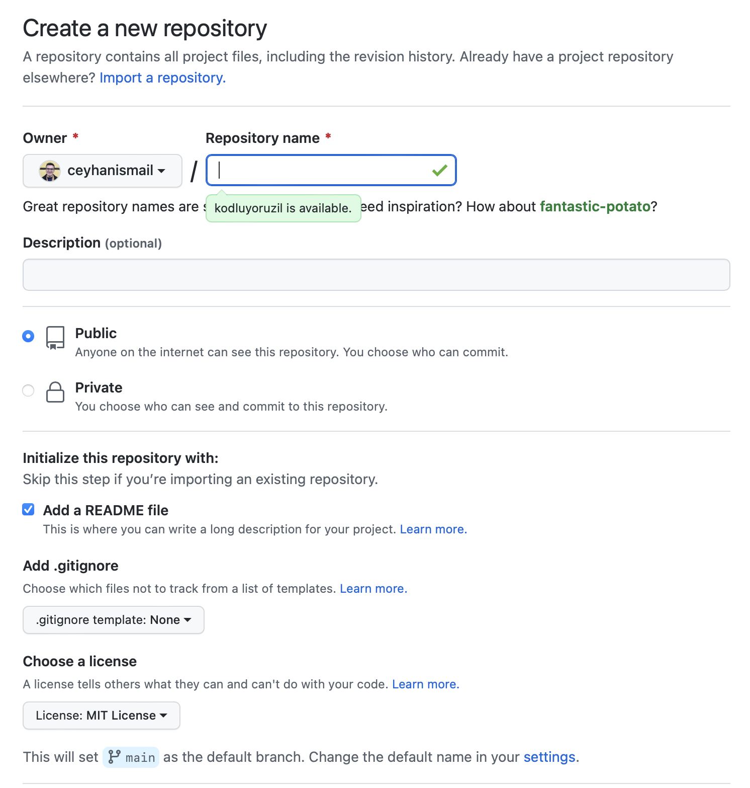

# Kodluyoruz Ilk Repo
Bu repo [Kodluyoruz](kodluyoruz.org) Frond-End Eğitiminde oluşturudğumuz ilk repo. İçerisinde bir adet README dosyası, bir adet de index.html barındırıyor



## Installation
Öncelikle projeyi clonelayın. (https://github.com/ceyhanismail/kodluyoruzilkrepo.git)
```
git clone https://github.com/ceyhanismail/kodluyoruzilkrepo.git
```
## Usage 
Projeyi cloneladıktan sonra Visual Studio Code açınız.

Linux için:

```
cd kodluyoruzilkrepo
code . 
```

## Contributing 
Pull requestler kabul edilir. Büyük değişikler için, lütfen önce neyi değiştirmek istediğinizi tartışmak için bir konu açın.

## Usage 
[MIT](https://choosealicense.com)